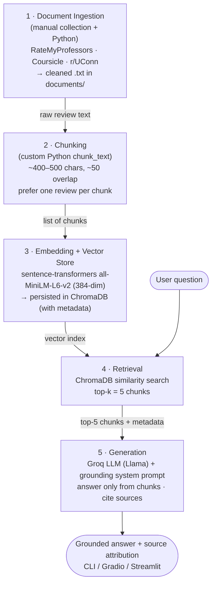

# Project 1 Planning: The Unofficial Guide

> Write this document before you write any pipeline code.
> Your spec and architecture diagram are what you'll use to direct AI tools (Claude, Copilot, etc.) to generate your implementation — the more specific they are, the more useful the generated code will be.
> Update the Retrieval Approach and Chunking Strategy sections if you change your approach during implementation.
> Update this file before starting any stretch features.

---

## Domain

<!-- What domain did you choose? Why is this knowledge valuable and hard to find through official channels? -->

The domain I chose is student reviews for computer science professors at the University of Connecticut. This knowledge is valuable because the official UConn course catalog and School of Computing site only list each CSE course's topics, credits, and prerequisites. They say nothing about what actually shapes a student's experience: which professor teaches a section best, how hard the exams are, whether the grade is curved, how heavy the weekly problem-set load is, whether lectures are worth attending, and how approachable the instructor is. That information lives only in student-written reviews scattered across RateMyProfessors, Coursicle, and r/UConn on Reddit. It's hard to find through official channels because the university has no incentive to publish candid assessments of teaching quality or difficulty, so a student has to piece it together across several sites.

---

## Documents

<!-- List your specific sources: URLs, subreddit names, forum threads, or file descriptions.
     Aim for at least 10 sources that together cover different subtopics or perspectives within your domain. -->

| # | Source | Description | URL or location |
|---|--------|-------------|-----------------|
| 1 | RateMyProfessors — UConn hub | Index of all rated UConn professors; entry point for CS faculty pages | https://www.ratemyprofessors.com/school/1091 |
| 2 | RateMyProfessors — Derek Aguiar | Reviews of a CSE professor (Algorithms / ML); mixed-to-positive opinions | https://www.ratemyprofessors.com/professor/2460362 |
| 3 | RateMyProfessors — Justin Furuness | Reviews of a CSE professor; teaching style and difficulty | https://www.ratemyprofessors.com/professor/3127655 |
| 4 | RateMyProfessors — Cooper Frank | Reviews of a CSE professor; highly rated | https://www.ratemyprofessors.com/professor/3120966 |
| 5 | RateMyProfessors — Jonathan Clark | Reviews of a CSE professor; teaching and grading feedback | https://www.ratemyprofessors.com/professor/2898389 |
| 6 | RateMyProfessors — Wei Zhang | Reviews of a CSE professor; low-rated (useful contrast / polarized opinions) | https://www.ratemyprofessors.com/professor/2999154 |
| 7 | Coursicle — CSE 2050 (Data Structures & Algorithms) | 78 course reviews across multiple professors | https://www.coursicle.com/uconn/courses/CSE/2050/ |
| 8 | Coursicle — CSE 3500 (Algorithms & Complexity) | 74 course reviews; workload, exams, professor comparisons | https://www.coursicle.com/uconn/courses/CSE/3500/ |
| 9 | Coursicle — CSE 3100 (Systems Programming) | 41 reviews; covers C, concurrency, memory mgmt; multiple instructors | https://www.coursicle.com/uconn/courses/CSE/3100/ |
| 10 | r/UConn — CSE professor recommendation threads | Reddit threads ("which prof for CSE ___?", "best/worst CS professors") | https://www.reddit.com/r/UConn/ (search "CSE professor"; save 1–2 specific thread URLs) |

---

## Chunking Strategy

<!-- How will you split documents into chunks?
     State your chunk size (in tokens or characters), overlap size, and explain why those
     numbers fit the structure of your documents.
     A review-heavy corpus warrants different chunking than a long FAQ. -->

**Chunk size:** Around 400–500 characters (About 100–128 tokens). Where a source is cleanly separable, split **one review per chunk** instead of fixed-size splitting.

**Overlap:** Around 50 characters on the fixed-size path; **0 overlap** when splitting per-review, since each review is already self-contained.

**Reasoning:** This is a review-heavy corpus, not long-form prose. An individual RateMyProfessors/Coursicle review is typically 1–4 sentences expressing one self-contained opinion about a specific professor or course. Large chunks would merge multiple unrelated reviews, including reviews of different professors, into a single vector. This blurs the embedding and hurts retrieval precision. Small, review-sized chunks keep each opinion as its own retrievable unit. The light overlap on the fixed-size path guards against a review being split mid-sentence. Before chunking I'll strip site boilerplate (navigation, "would take again %", ad text) so chunks contain review text only.

---

## Retrieval Approach

<!-- Which embedding model are you using (e.g., all-MiniLM-L6-v2 via sentence-transformers)?
     How many chunks will you retrieve per query (top-k)?
     If you were deploying this for real users and cost wasn't a constraint, what tradeoffs
     would you weigh in choosing a different embedding model — context length, multilingual
     support, accuracy on domain-specific text, latency? -->

**Embedding model:** `all-MiniLM-L6-v2` via `sentence-transformers`. Chosen because it's fast, runs locally with no API cost, and its short context window is a fine match for short reviews. Embeddings are stored and queried in ChromaDB.

**Top-k:** **5.** Reviews are short and individually noisy/opinionated, so a single chunk is a weak basis for an answer. Retrieving 5 lets the generator synthesize across several students' opinions and avoid over-weighting one outlier review. It's small enough to stay well within the generator's context budget.

**Production tradeoff reflection:** If cost weren't a constraint and this served real students, I'd weigh: **(1) Accuracy on domain text** - a larger model better captures nuance like sarcasm and hedged opinions that are common in reviews. **(2) Context length** — MiniLM truncates at around 256 tokens, so unusually long reviews lose their tail, and a longer-context model would preserve them. **(3) Latency & local vs. API** — MiniLM is local and instant. API models add network latency and per-call cost but offload compute. **(4) Multilingual** — not needed here (reviews are English), so I wouldn't pay for multilingual capability. Net: I'd likely move to `all-mpnet-base-v2` for an accuracy bump while staying local, before reaching for a paid API model.

---

## Evaluation Plan

<!-- List your 5 test questions with their expected correct answers.
     Questions should be specific enough that you can judge whether the system's response
     is right or wrong. "What are good dining halls?" is too vague.
     "What do students say about wait times at [dining hall name] during lunch?" is testable. -->

| # | Question | Expected answer |
|---|----------|-----------------|
| 1 | What do students say about taking CSE 3500 (Algorithms) with Derek Aguiar? | Highly regarded / among the best CS professors; cares about students learning the material; challenging but interesting problem sets every 1–2 weeks with partner allowed, posts lecture notes online, and exams are straightforward and mostly curved. |
| 2 | Which professor do students recommend for CSE 2050 (Data Structures & Algorithms)? | Don Sheehy is praised. The students call it one of the best classes in the CS department, with lectures that make you think about core CS fundamentals. |
| 3 | Are exams in CSE 3500 curved, and how hard are they? | Exams are described as straightforward with most things curved. The difficulty is in the weekly/biweekly problem sets rather than the exams. |
| 4 | What is the workload like in CSE 3500? | Problem sets every 1–2 weeks that are challenging but interesting. You can work with a partner and the class is manageable given the curve. |
| 5 | Who teaches CSE 3100 (Systems Programming) and what does it cover? | Taught by instructors such as Wei Zhang, Swamy Pattipati, and Ion Mandoiu. The course covers system-level / C programming, processes, small-scale concurrency (multithreading), and memory management/debugging. |

<!-- After collecting the real documents, re-verify these expected answers against the actual
     review text and adjust wording so each stays judgeable as right/wrong. -->

---

## Anticipated Challenges

<!-- What could go wrong? Name at least two specific risks with reasoning.
     Consider: noisy or inconsistent documents, missing source attribution, off-topic
     retrieval, chunks that split key information across boundaries. -->

1. **Polarized / inconsistent reviews for the same professor.** Ratings on RateMyProfessors swing hard. The same instructor can have 5-star and 1-star reviews (e.g., Wei Zhang's page sits near 1.0 while others sit near 5.0). With top-k retrieval the system may surface a one-sided slice and present a lopsided verdict. Reviews are also undated in the chunk text, so an instructor who improved over the years can be misrepresented by old complaints. Mitigation: retrieve enough chunks (k=5) and prompt the generator to report the range of opinions rather than a single verdict.

2. **Off-topic / cross-entity retrieval and split context.** Professor-name and course-number collisions (one professor teaches several CSE courses) can make a query about one course pull reviews about that professor's other course. Because reviews are terse, embeddings are sparse and nicknames/initials may not match well. And a fixed-size chunk boundary can separate a claim from its qualifier ("great lecturer **but** impossible exams"), so retrieval returns only half the sentiment. Mitigation: per-review chunking where possible, light overlap otherwise, and including the professor/course label in each chunk's text.

---

## Architecture

<!-- Draw a diagram of your pipeline showing the five stages:
     Document Ingestion → Chunking → Embedding + Vector Store → Retrieval → Generation
     Label each stage with the tool or library you're using.
     You can use ASCII art, a Mermaid diagram, or embed a sketch as an image.
     You'll use this diagram as context when prompting AI tools to implement each stage. -->

---

## AI Tool Plan

<!-- For each part of the pipeline below, describe:
     - Which AI tool you plan to use (Claude, Copilot, ChatGPT, etc.)
     - What you'll give it as input (which sections of this planning.md, which requirements)
     - What you expect it to produce
     - How you'll verify the output matches your spec

     "I'll use AI to help me code" is not a plan.
     "I'll give Claude my Chunking Strategy section and ask it to implement chunk_text()
     with my specified chunk size and overlap" is a plan. -->

**Milestone 3 — Ingestion and chunking:**
I'll use **Claude (Claude Code)**. Input: my **Chunking Strategy** section above plus 2–3 sample raw review files from `documents/`. I'll ask it to implement `load_documents()` (read every `.txt` in `documents/`, strip boilerplate) and `chunk_text(text, size=500, overlap=50)`, with the per-review split as the preferred path. Expected output: two functions returning a clean list of chunk strings with source metadata. How I'll verify: run on the real files and confirm the chunk count is reasonable, no chunk merges two different professors, and no chunk is cut mid-word, and adjusting `size`/`overlap` if the strategy doesn't hold on real data.

**Milestone 4 — Embedding and retrieval:**
I'll use **Claude**. Input: my **Retrieval Approach** section (model = `all-MiniLM-L6-v2`, top-k = 5) and the chunk list from M3. I'll ask it to embed the chunks with `sentence-transformers`, persist them in a **ChromaDB** collection with metadata, and write `retrieve(query, k=5)`. Expected output: an indexing script plus a retrieval function returning the top-5 chunks with their sources. How I'll verify: run my 5 evaluation questions and check that the returned chunks are actually about the right professor/course *before* any generation. If the retrieval is off-target, I will revisit chunking or k.

**Milestone 5 — Generation and interface:**
I'll use **Claude**. Input: the retrieval function, my grounding requirements, and the Groq stack from `requirements.txt`. I'll ask it to write a grounded-generation function that feeds the top-5 chunks to a **Groq** Llama model under a system prompt that forbids answering beyond the retrieved text and requires source attribution (with a "not enough information" fallback), then wrap it in a simple **Gradio/Streamlit** interface. Expected output: `generate_answer(query)` plus a minimal UI. How I'll verify: run all 5 eval questions end-to-end, confirm answers match the expected column, and probe an off-domain question (e.g., "best dining hall?") to confirm the system declines instead of hallucinating.
